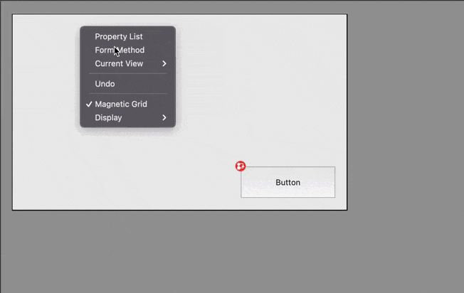

# Form Object

[![language][code-shield]][code-url]
[![language-top][code-top]][code-url]
![code-size][code-size]
[![release][release-shield]][release-url]
[![license][license-shield]][license-url]
[![discord][discord-shield]][discord-url]

Parse form JSON 4DForm files, to create classes, provide functions and why not generate some codes.

## Macros

### Form Event Case of

`FormEvent` type ahead macro generate `Case of` for form event code.



The macro will search the activated events in the corresponding `4DForm` form file, before pasting the code.

### Form objects classes instanciation

The base contains type ahead macro `FormObjectToPasteBoard`(to use in form default method) or `Class Code To Pasteboard`(`FormCode` class) form macro to generate some code to instanciate some classes by form objects.

For instance:

```4d
This["Button"]:=cs.button.new("Button")
This["Text"]:=cs.text.new("Text")
This["Combo Box"]:=cs.combo.new("Combo Box")
This["Combo Box1"]:=cs.combo.new("Combo Box1")
This["Button Grid"]:=cs.buttonGrid.new("Button Grid")
This["Thermometer1"]:=cs.progress.new("Thermometer1")
```

### Css Macros

#### AppendFormToCss

Get all or selected object and add object name and class if missing in css file

#### AssignClassMacro

Show a popup menu to select an existing class from css and apply to selected objects

## Use the code

### Getting the current form object as instance of `Form` object

```4d
formParser:=formParser() // do only one time to get the parser
```

Then in form context

```4d
$form:=formParser.current()
```

### Parsing a form ie. getting an instance of `Form`

#### by passing the form name

```4d
$form:=formParser.parse("MyFormName") // return your form object
```

#### by passing the `4DForm` file

```4d
$formsFolder:=Folder(fk database folder).folder("Project/Sources/Forms")
$formFile:=$formsFolder.folder("FormButton").file("form.4DForm")

$form:=formParser.parse($formFile)
```

### Parsing all forms

```4d
$forms:=formParser.parseAll() // collection of Form
```

## Examples of usage

### getting an object by its name in specific page

```4d
$myButton:=$form.pages[1].objects["Button0"] // instance of formParser.cs.Button (extends formParser.cs.Object)
```

##### and manipulate it with functions

There is a log of getter and setters for [`Object`](Project/Sources/Classes/Object.4dm)

```4d
$myButton.setVisible(False)
$myButton.setEnabled(False)
// or $myButton.apply(New object("visible"; False; "enabled"; False))
```

#### get an object without parsing form

> Why? to get all function available in [`Object`](Project/Sources/Classes/Object.4dm)

```4d
$myButton:=formParser.object("MyButtonName")
```

If you want to specify the type

```4d
$myButton:=formParser.object("MyButtonName", "button") // or formParser.button("MyButtonName")
```

#### generate event code

Using this code, the form method code will be replaced by a `Case of` on all available events. This code is used for the macro.

```4d
$form.setMethodCode($form.generateEventCode())
```

example of result

```4d
$eventCode:=Form event code
Case of 
  : ($eventCode=On Load)

  : ($eventCode=On Page Change)

  : ($eventCode=On Validate)

  Else 

End case 
```

## Other components

[](https://mesopelagique.github.io/)

<!-- MARKDOWN LINKS & IMAGES -->
<!-- https://www.markdownguide.org/basic-syntax/#reference-style-links -->
[code-shield]: https://img.shields.io/static/v1?label=language&message=4d&color=blue
[code-top]: https://img.shields.io/github/languages/top/mesopelagique/FormObject.svg
[code-size]: https://img.shields.io/github/languages/code-size/mesopelagique/FormObject.svg
[code-url]: https://developer.4d.com/
[release-shield]: https://img.shields.io/github/v/release/mesopelagique/FormObject
[release-url]: https://github.com/mesopelagique/FormObject/releases/latest
[license-shield]: https://img.shields.io/github/license/mesopelagique/FormObject
[license-url]: LICENSE.md
[discord-shield]: https://img.shields.io/badge/chat-discord-7289DA?logo=discord&style=flat
[discord-url]: https://discord.gg/dVTqZHr
